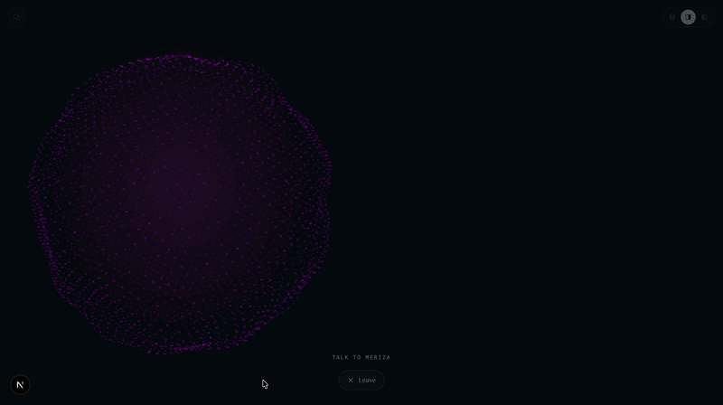
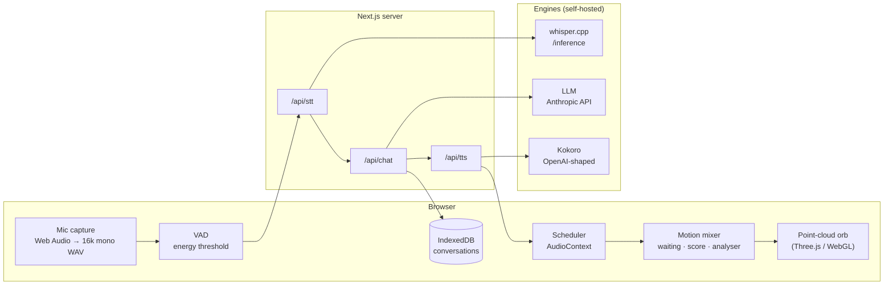
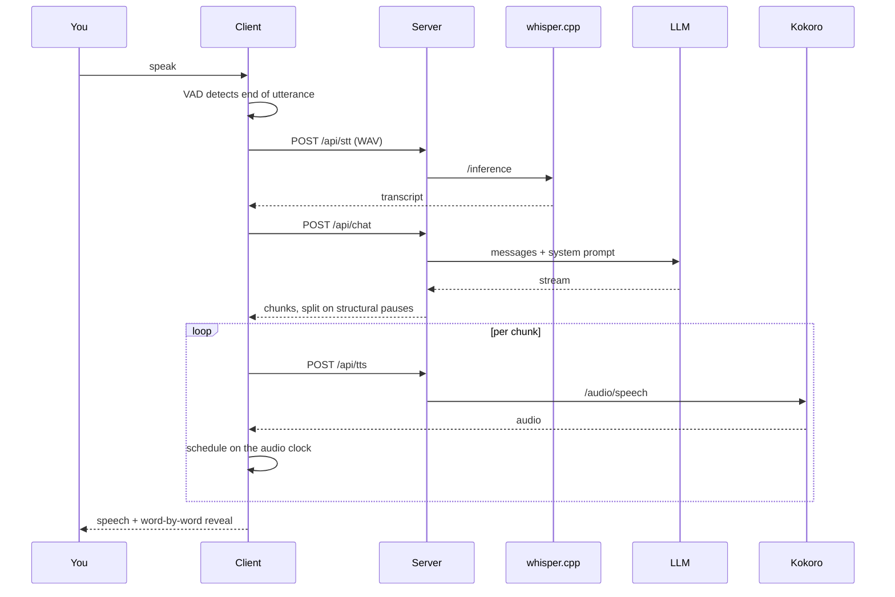
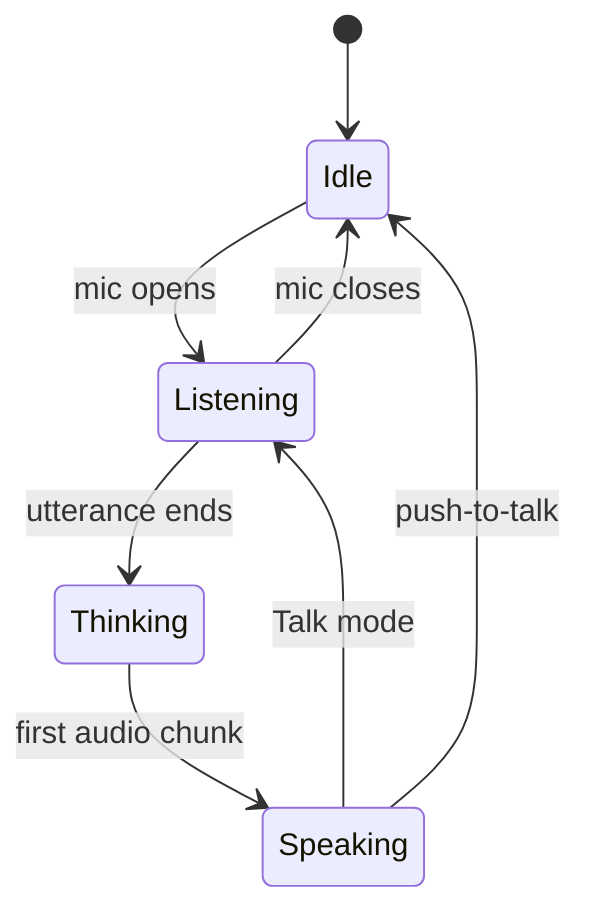
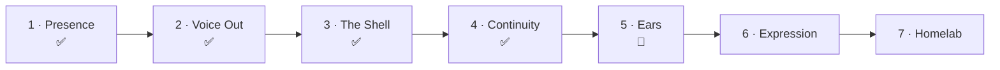

# Meriza

A presence-first conversational interface. A living point-cloud orb that listens, thinks and speaks — the body of the assistant rather than a visualizer bolted onto a chat log.



> **Status: in development.** Phases 1–4 are complete, Phase 5 is substantially done. Things move. Interfaces change. See [Roadmap](#roadmap).

---

## What it is

Most chat UIs are a text box with a spinner. Meriza inverts that: the orb is the primary surface, the transcript is secondary, and the reply is written to be *heard* rather than skimmed.

Three properties follow from that premise and drive most of the design:

- **The orb reflects the model lifecycle**, not audio volume. Waiting, thinking and speaking are visually distinct because they are different states, not different amplitudes.
- **The transcript records what was *said*.** Markdown is stripped before synthesis, emoji never reach the engine, and words appear on screen paced to the audio clock — reading speed is locked to speaking speed by design.
- **Local-first, bring your own key.** No accounts, no backend of ours. You supply an LLM key and point at your own speech engines.

---

## Architecture



The server routes exist for one reason: engine URLs and the API key never reach the client.

### The provider seam

Both speech sides sit behind an interface, but they are not equally portable, and the README should be honest about that:

| | Interface | Swapping engines |
|---|---|---|
| **TTS** | `TTSProvider` | Env-only. The OpenAI-compatible implementation covers Kokoro, Chatterbox and friends. |
| **STT** | `STTProvider` | Needs a new implementation. whisper.cpp serves `/inference`, not the OpenAI transcription path — pretending otherwise would put a broken swap behind an env var. |

---

## A turn, end to end



The chunking is what makes it feel immediate: the first sentence is already being spoken while the rest of the reply is still generating. Chunks end on structural breaks — sentence ends, paragraph breaks, code fences — so the seams land where a speaker would have paused anyway.

---

## The orb



Motion comes from a **mixer** that crossfades between three sources rather than switching hard:

- **waiting** — ambient drift, nothing is happening
- **score** — a pre-computed motion curve, used when audio isn't driving the shape
- **analyser** — live FFT from the playing audio

The score is an *alternative* to the analyser, not filler to cover latency. Covering a visual dead spot with motion that means nothing inverts the premise.

---

## Stack

| Layer | Choice |
|---|---|
| App | Next.js · TypeScript · Tailwind |
| Rendering | Three.js / WebGL |
| Audio | Web Audio API — AudioContext scheduling, analyser |
| TTS | Kokoro (300MB, Apache 2.0, CPU-viable) |
| STT | whisper.cpp |
| Storage | IndexedDB |

---

## Running it

You need three things alive: the app, a TTS engine, and an STT engine.

### 1. The speech engines

```bash
# Kokoro (macOS / Apple Silicon)
brew install uv espeak-ng
git clone https://github.com/remsky/Kokoro-FastAPI.git
cd Kokoro-FastAPI && ./start-gpu_mac.sh

# whisper.cpp
whisper-server -m models/ggml-base.en.bin --port 8081
```

### 2. The app

```bash
npm install
cp .env.example .env.local   # then fill it in
npm run dev
```

### 3. Environment

| Variable | What it does |
|---|---|
| `ANTHROPIC_API_KEY` | LLM provider key |
| `MERIZA_MODEL` | Chat model |
| `MERIZA_SYSTEM_PROMPT` | Optional override of `lib/llm/prompt.ts` — the file is the real knob |
| `TTS_BASE_URL` | Engine base, including `/v1` |
| `TTS_MODEL`, `TTS_VOICE` | Voice ids are engine-specific and never portable |
| `STT_BASE_URL` | whisper.cpp server base |

Keep `.env.example` in sync with anything added here.

### Scripts

```bash
npm run dev         # development server
npm run build       # production build
npm run typecheck   # TypeScript
npm run lint        # ESLint
docker compose up   # self-hosted app from env (engines run separately)
```

---

## Features today

**Voice out** — chunked synthesis with gapless scheduling, markdown and fenced-code rendering, emoji stripping, word-by-word reveal paced to audio.

**Ears** — push-to-talk with a live input waveform, energy-threshold VAD, and Talk mode that holds the mic open between utterances so there is no deaf gap. A tuning harness lives at `/lab/vad`.

**The shell** — focus mode with a persistent exchange anchor, overlay and split layouts, a settings modal (Voice, Listening, Theme, Data), and a full palette system with per-state colour.

**Continuity** — conversations persisted to IndexedDB, a switcher overlay, and AI-generated titles.

---

## Roadmap



- **Expression** — sentiment drives the orb. Tone and colour respond to meaning, not amplitude.
- **Homelab** — deployed and running without the Mac. The engines move off localhost.

Tracked as GitHub milestones, worked issue by issue, branch per issue, squash-merged.

---

## Design notes

Two living documents carry the reasoning, and they matter more than this README:

- **`decisions.md`** — standing calls and why, written so coming back after a month doesn't mean re-deriving everything, and so a guess is never mistaken for a measurement.
- **`CLAUDE.md`** — the working rulebook: contracts, scope guardrails, file layout.

A few that shape the codebase:

- **Replies are written for the ear.** The system prompt asks for spoken numeric forms and minimal structure. A listener cannot skim. This is also why there is no numeric normalizer in the speech path — `$400B` was already worse on screen than the spoken form, so fixing it at the model end fixes both surfaces.
- **Message positions derive from conversation index, not a counter.** A discarded reply used to burn a position.
- **VAD uses energy thresholding.** Silero's dependency cost isn't justified; echo cancellation handles same-device playback, verified empirically rather than assumed.
- **Stale closures are a project pattern.** Anything created once and handed a callback needs ref indirection. This has bitten four times in four different disguises.
- **The focus-mode anchor is padding, not scroll position.** Several scroll-based attempts failed before that landed.

---

## License

TBD.